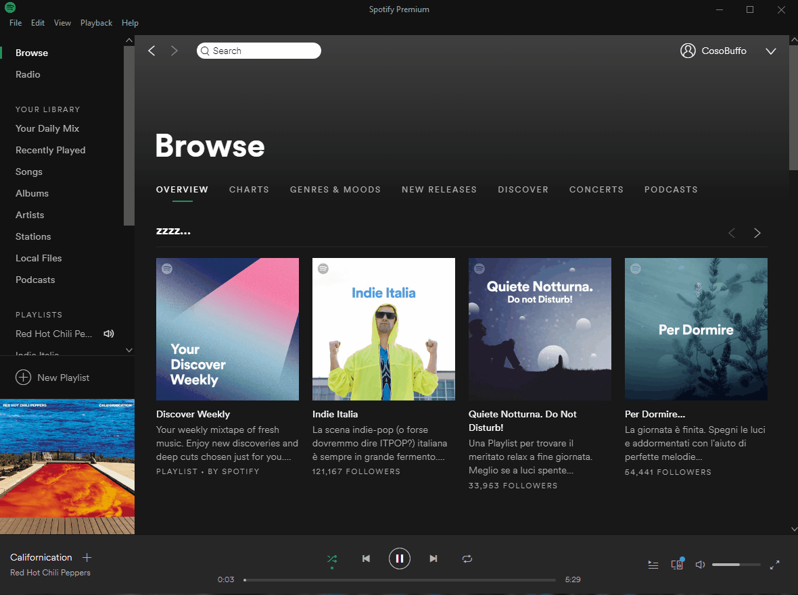

# Cerebro plugin for Spotify

A [Cerebro](https://cerebroapp.com) plugin for [Spotify](https://www.spotify.com).

### Usage:
Just type <strong>s</strong> or <strong>spotify</strong> than the name of the song/album or the artist

### Screenshot:

Contributions are welcome, please submit a pull request or open an issue.
